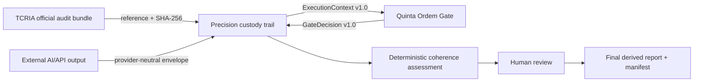

# Precision Gate

> Mobile custody and operational precision layer for TCRIA + Quinta Ordem Gate.

Precision Gate is a new product. It is not a copy of TCRIA, not a replacement for Quinta Ordem Gate, and not an autonomous decision-maker.

It is a **mobile custody reference layer** that follows information as it moves through an audit trail, preserving provenance, state, support, warnings, gate decisions, and human-review requirements.

## Core idea

Precision Gate tracks outputs from:

- TCRIA, as the informational producer and governance/audit organizer;
- Quinta Ordem Gate, as the deterministic verification engine;
- API outputs, when an external model or service produces a synthesis, opinion, institutional output, or final text.

Its job is to preserve the trail and point to where operational truth is best supported.

It does not force a decision.

The final decision remains human.

## Golden rule

Precision Gate follows the TCRIA golden rule:

> Analyze carefully, preserve custody, classify uncertainty, and keep the flow moving — unless evidence reading itself fails.

The flow may continue through nulls, opinions, hypotheses, warnings, signals, pending points, and returns. However, no output may be promoted beyond the support it has.

If OCR or evidence extraction fails, the system must not pretend that the evidence was read. The trail may continue as a failure record, but the content cannot be promoted as reliable textual evidence.

## Product boundaries

TCRIA remains the original product.

Fifth-order / Quinta Ordem Gate remains the deterministic gate product.

Precision Gate is the third product: the mobile custody, precision, alert, and reporting layer that composes both while preserving their boundaries.

No TCRIA principle may be abandoned, weakened, replaced, or silently bypassed without explicit owner consent.

## Human decision

Precision Gate informs, classifies, alerts, and preserves custody.

It does not replace human judgment, institutional authority, legal review, medical review, credit review, or any final decision affecting rights, health, liberty, finance, or third parties.

## Initial integration sources

- TCRIA base: `batt1984rodrigo-del/tcria-09215b00`
- Quinta Ordem base: `batt1984rodrigo-del/Fifth-order/tree/main/quinta-ordem-gate`

## First implementation direction

The reference implementation now defines:

- immutable, versioned custody events;
- an append-only SHA-256 receipt chain;
- strict adapters for the official TCRIA audit bundle, external API output, and Quinta
  Ordem contracts;
- deterministic coherence alerts;
- monotonic block, read-failure, and human-review requirements;
- final-only JSON, Markdown, and manifest artifacts;
- observed validation metrics for operational precision and release safety.

## Architecture



Precision Gate never reads a path from a TCRIA bundle to reopen original evidence. It
does not invoke an AI provider. It does not copy TCRIA or Quinta Ordem decision logic.
Each product remains independently governed.

## Runtime modules

| Module | Responsibility |
|---|---|
| `contracts.py` | Versioned states, source references, immutable events, promotion guards |
| `ledger.py` | Canonical event serialization, SHA-256 receipts, chain verification |
| `tcria_adapter.py` | Strict observation of a completed official TCRIA audit bundle |
| `api_output_adapter.py` | Provider-neutral observation of external AI/API output |
| `quinta_adapter.py` | Quinta `ExecutionContext` handoff and `GateDecision` ingestion |
| `coherence.py` | Deterministic divergence, omission, promotion, and custody alerts |
| `pipeline.py` | Explicit external handoff and human-review stages |
| `reporting.py` | Final consolidated JSON/Markdown report and manifest |
| `metrics.py` | Labeled-case operational validation metrics |

## Quick start

```bash
python -m pip install -e ".[dev]"
python examples/run_precision_gate.py
```

The example uses synthetic data only and writes derived Markdown views to `outputs/`.
`PrecisionPipeline` is a compatibility API for classification-only orchestration. It
cannot finalize or release an output. Consequential workflows must use
`PrecisionGatePipeline`, including its Quinta decision, human review, custody, coherence,
and finalization stages.

## Release semantics

`released` means that an output is eligible for delivery to the responsible human or
institutional flow. It requires:

1. an `APPROVED` Quinta Ordem result;
2. completed human review with an accepted outcome;
3. no unresolved block, read failure, review requirement, or coherence conflict;
4. a valid append-only custody chain.

It does not mean that Precision Gate decided a right, legal responsibility, medical
question, credit outcome, liberty interest, or other material consequence.

## External API boundary

The first implementation deliberately keeps AI/API execution outside Precision Gate.
The adapter accepts only a versioned envelope containing input references, provider/model
metadata, prompt reference or hash, output reference/hash, output nature, and optional
claim relations. It neither requests nor stores hidden chain-of-thought.

## Validation

```bash
python -m pip install -e ".[dev]"
pytest
ruff check .
```

The default `0.95` validation target is measured over labeled cases with explicit
numerators, denominators, and sample sizes. A metric with no eligible cases is
`not_evaluated`, never an artificial 100%.

See [`docs/PRODUCT_ARCHITECTURE.md`](docs/PRODUCT_ARCHITECTURE.md),
[`docs/INTEGRATION_CONTRACTS.md`](docs/INTEGRATION_CONTRACTS.md), and
[`docs/CHAIN_OF_CUSTODY.md`](docs/CHAIN_OF_CUSTODY.md) for the complete contract.
