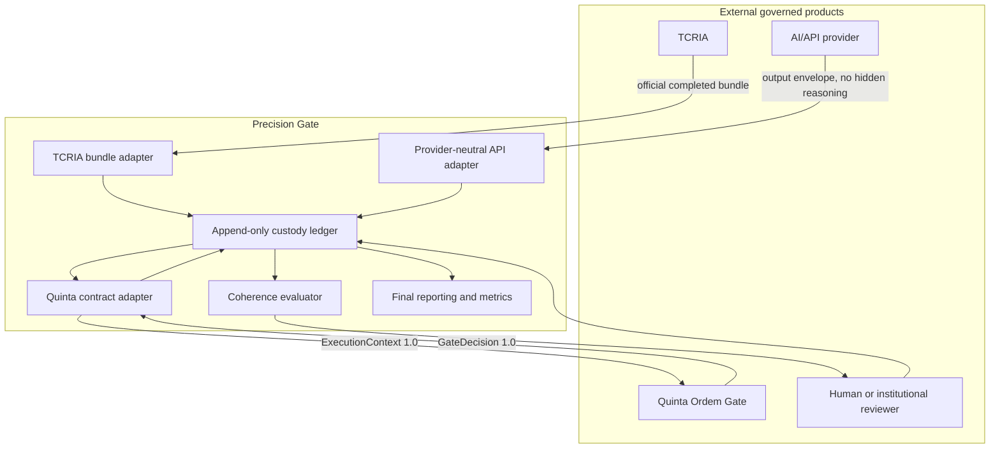
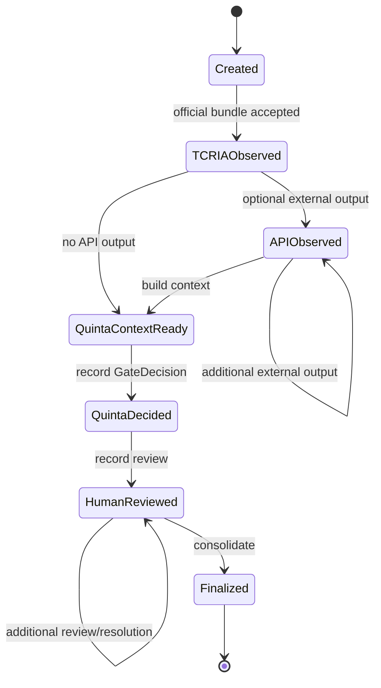

# Precision Gate Product Architecture

## Product identity

Precision Gate is a third product.

It is not TCRIA.
It is not Quinta Ordem Gate.
It is not an API wrapper.
It is not an autonomous decision engine.

It is a mobile custody, precision, and alert layer that follows information across the audit trail.

## Product triangle

```text
TCRIA
  -> produces structured audit information, signals, gates, classifications, bundles, and institutional outputs

Quinta Ordem Gate
  -> verifies integrity, traceability, evidence support, logical consistency, and resolution

Precision Gate
  -> tracks the information in motion, classifies its state, preserves custody, alerts inconsistencies, and supports human decision
```

## Flow rule

The flow does not stop merely because a layer returns null, warning, opinion, hypothesis, or pending signal.

The flow continues, but the state travels with the information.

```text
information item
  -> source state
  -> TCRIA state
  -> API state
  -> Quinta Ordem state
  -> Precision Gate state
  -> human-review state
```

## Non-coercive reference rule

Precision Gate can alert, classify, and point.

It can say:

- this is supported;
- this is unsupported;
- this is pending;
- this is blocked;
- this is an API inference;
- this is a TCRIA signal;
- this is not readable evidence;
- this contradiction should be reviewed;
- this output appears to rely on weak support.

It cannot force a final decision.

The final decision remains human.

## API transparency rule

Precision Gate must not assume that an API will explain its internal reasoning.

When an API returns only a final result, Precision Gate tracks the external relation between:

- input payload;
- TCRIA bundle;
- API prompt or preset;
- API model and response metadata;
- API output;
- Quinta Ordem evaluation;
- Precision Gate state.

The API may be silent internally. The custody trail must remain externally auditable.

## Alert behavior

Precision Gate must be able to warn the surrounding system when a responsibility, inconsistency, omission, or unsupported promotion appears in the trail.

It points to operational responsibility, not final legal guilt.

Example alert language:

```text
A conclusion appears to rely on a signal that was not promoted to fact.
A previous block is present and must not be erased.
A document was unreadable; textual support cannot be presumed.
An API conclusion diverges from the TCRIA gate state.
A pending human review point was ignored by a later output.
```

## Executable component model



The adapters are pure contract boundaries. They do not read original evidence, call a
network service, or import either upstream core.

## Pipeline stages



External calls happen outside this state machine. Precision Gate prepares or observes
their contracts; it does not hide remote work inside a custody transition.

## Event and receipt model

Every event includes:

- schema version, trace ID, sequence, event ID, and observation time;
- source layer and source artifact reference;
- source artifact and canonical payload SHA-256 where available;
- information ID, informational state, and custody state;
- explicit support, cause, and resolution references;
- gate and human-review state where applicable;
- a summary and constrained derived metadata.

The ledger canonicalizes the event, links it to the preceding receipt, and calculates a
new SHA-256. Verification detects mutation, insertion, removal, reordering, duplicate
event IDs, trace substitution, and final-receipt mismatch.

## State and promotion rules

| State family | Continues in trail | May be a supported fact | Requires review |
|---|---:|---:|---:|
| `fact_supported` with explicit support and traceable custody | Yes | Yes | By later gate/context |
| `allegation`, `hypothesis`, `signal_pending`, API opinion/inference | Yes | No | Yes when consequential |
| `null_result`, `pending` | Yes | No | Yes |
| `extraction_failed`, `ocr_failed`, `unreadable` | Failure record only | No | Yes |
| `returned_for_correction`, `blocked` | Yes | No | Yes |
| `released` | Final derived event | Not a new fact | Completed human review |

Blocks, read failures, and review requirements are monotonic. A later event may resolve
one only by naming its event ID. Resolving a read failure additionally requires an
explicit human support reference; it cannot retroactively pretend OCR succeeded.

## Coherence rules

The evaluator emits coded alerts rather than free-form accusations. It checks:

- unsupported promotion or facts without traceable support;
- use of unreadable information as factual support;
- release after an unresolved block or review requirement;
- conflicting source digests;
- external API support for blocked information;
- API divergence from an explicit TCRIA fact or non-approved Quinta result;
- information described as unseen despite appearing in the TCRIA trail;
- observed-but-unmentioned information with and without a documented omission reason;
- explicitly contradictory top-supported readings.

“Best supported” is a deterministic support tier, not a truth probability. Equal
contradictory readings produce a conflict and human-review requirement, not an invented
winner.

## Reporting boundary

Intermediate stages retain events and receipts only. Formal JSON, Markdown, and manifest
artifacts are produced after finalization. The manifest is written last and binds the
derived files to the final custody receipt. Reports contain references, hashes, states,
alerts, and summaries, never source `document.text`.

## Validation target

The 95% target is evaluated over labeled cases for:

- supported-release precision;
- unsupported-promotion prevention;
- custody-chain integrity;
- required-review capture;
- safe finalization rate.

Each metric carries its numerator, denominator, sample size, value, and target status.
Zero denominators are `not_evaluated`. The target is an observed engineering threshold,
not certainty of truth or correctness of a human decision.

## Design stop rule

If any component cannot preserve TCRIA principles, evidence custody, human decision, or state distinction, the implementation must stop and ask the owner for a decision.
